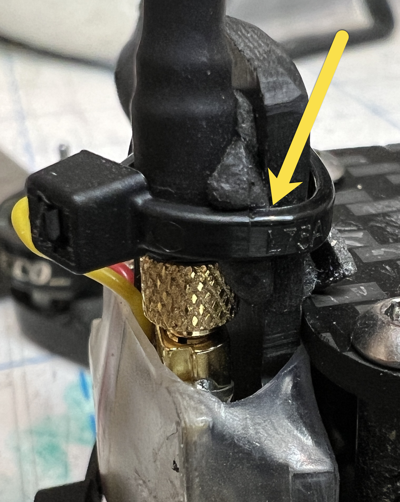

rear-three-quarter-view-mounted-close.png

rear-three-quarter-view-mounted.png

rear-view-mounted.png

side-view-mounted.png

# Ass Paddle

The Ass Paddle is the go-to solution for securing a VTX to the chassis of a sub-250-gram drone, particularly the Fun Hog.

Design features include:

* Compatible with miro and larger legacy VTX (e.g., Mach series)
* Vented to save weight and increase airflow
* Natural breakaway in serious crashes (e.g., yard sale)
* Antenna **only** fastening
* Easy mounting and modular
* Field repairable
* Built-in bumper for tail-heavy landings
* Great airflow and cooling
* High visibility and full access to controls and display
* Decrease or eliminate sympathetic vibration caused by the antenna

## Installation

Direct, connect your VTX to the Ass Paddle. Any combination of double sticky, shrink, and cable tie will work.

Optionally and **recommended**, secure the antenna.  By securing the antenna to the Ass Paddle, any fatal impact of the antenna will not break the PCB or VTX.  This fixture takes all of the energy, thus saving the VTX at the expense of the antenna using the Ass Paddle.

Finally, attach the Ass Paddle and VTX combo to the back (ass) of the drone.  Many variations exist, but a combination of cable-tie and double sticky works very well.

A standard connector, such as a Micro JST, combined with a single well-mounted cable tie and minimal double-sticky will allow the Ass Paddle to break away when otherwise lost.  

Improvise and improve as necessary; the Ass Paddle is purposefully simple in design.

