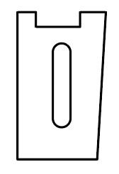
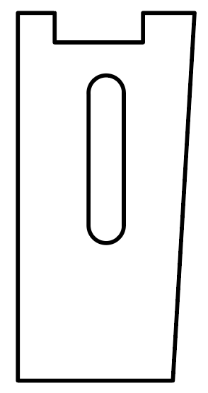

# Camera Flaps

Camera flaps allow secure and modular camera mounting to the Fun Hog sub-250 gram drone and most other drones.

Correct use yields footage that mirrors your tune. Add in black box gyroscope data, and your video capture and flights reach a new level.

## Installation

The carbon fiber flaps mount between the upper and lower plate of the build. The use of adhesive-dampening material adds the final touch.

## Ride Height

The camera flap height is the same as your stand-off height. Commonly 20-30mm in sub-250 builds.

By tightening the plates and adding adhesive-dampening material, the camera flaps hold a wide variety of camera stable for any drone.

[picture next to stand off lying down on bench]

## Use and Application

There is a flat and angled long side to the camera flap.  The straight side goes against the front stand-off.

The angled side allows one side to have a broad base. The shape also adds flexibility to clear a variety of electronic sacks.

The adhesive-dampening material keeps the camera flaps in place via friction+pressure and, optionally, stickiness.  The tested material includes double sticky tape, VHX, and silicone (various densities).

[picture in build next to the stand-off with plates installed]

## Even More

First is the **notch** on the top of the flaps.  The notch allows routing cable tie(s), as we do for the Naked Thumb installation.  It also saves a little weight.

[picture of cable tie routing]

Additional stability may be necessary.  In such an event, there are many ways to escalate the mount with minimal added weight.

Consider a small cable tie around the bottom of the flaps, pulling towards the stand-off.

The addition of more or different adhesive-dampening materials may help. The additional material can also run vertically between the stand-off and contact with the flaps.

## Sizes Available

*Designed as needed.*

**20mm:**

**25mm:**

